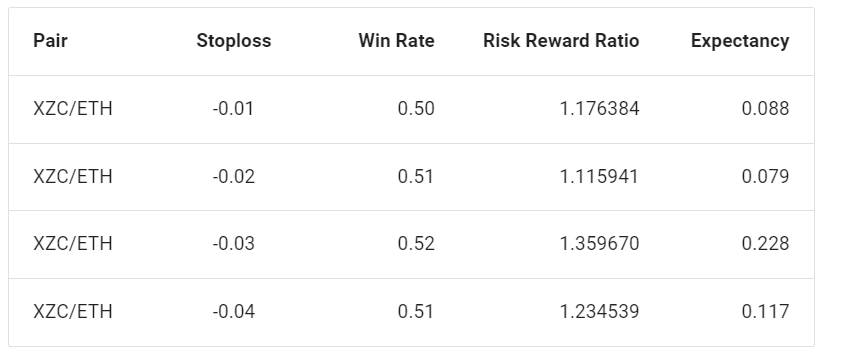
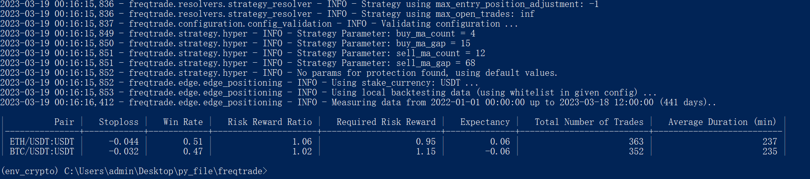

Edge positioning直译为"边缘定位", 但是这个词比较晦涩难懂, 为了便于理解, 和策略保护相对应, 我将其称之为"策略优化"

## 简介

Edge positioning是Freqtrade中提高策略收益的一个模块, 它通过统计已有交易历史数据中的胜率和风险回报率来调整止损和头寸规模

**注意事项**

1. Edge positioning会忽略原始策略和配置中所有的止损(包括minimal_roi)
2. 根据历史统计数据做出的判断, 并不一定会改善策略未来的收益
3. 使用Edge需要保证必须有历史交易记录
4. 回测必须配置: "max_open_trades": -1
5. 实盘必须配置: "max_open_trades": -1; "stake_amount": "unlimited"

## 工作原理

#### 计算公式

1. 胜率W=盈利总次数/交易总次数
2. 风险回报率R=平均利润/平均亏损
3. 预期比率E=R*W - (1-W)

**解释**
1-W: 表示亏损概率, E意味着每损失1个单位能获得的超额利润

假设一个策略W=0.28, R=5, 计算E=0.68. 表示每损失1美元可赚取1.68美元

#### 计算最佳止损



Edge会通过一系列止损计算得到预期比率E, 然后选择预期比率最大的止损值. 如上图, 选择止损为-0.03

#### 计算头寸规模

1. 在Edge的配置中有"allowed_risk"表示允许的风险比率, 即每笔交易可损失的资金百分比

假设配置中"stake_currency=USDT", 钱包中USDT总额为1000(包括持仓占用的USDT), "tradable_balance_ratio=0.5", 则钱包可用于交易的资金为500. 若allowed_risk=0.01, 计算得到的最佳止损为-0.05, 则头寸规模size=500*0.01/0.05=100USDT

## 文件配置

- "enabled": 是否启用, 默认false
- "process_throttle_secs": 多久运行一次, 单位秒, 默认3600(1小时)
- "calculate_since_number_of_days": 计算预期比率需要的数据天数, 默认7
- "allowed_risk": 允许的风险比率, 默认0.01, **用来调整头寸规模**
- "stoploss_range_min": 最小止损, 默认-0.01
- "stoploss_range_max": 最大止损, 默认-0.1
- "stoploss_range_step": 步长值, 默认-0.001
- "minimum_winrate": 过滤胜率小于该值的货币对, 默认0.6
- "minimum_expectancy": 过滤预期比率小于该值的货币对, 默认0.2
- "min_trade_number": 过滤交易次数小于该值的货币对, 默认10
- "max_trade_duration_minute": 过滤交易持仓时间高于该值的交易, 单位分钟, 默认1440(一天)

参考配置

```json
    "edge": {
        "enabled": false,
        "process_throttle_secs": 3600,
        "calculate_since_number_of_days": 7,
        "allowed_risk": 0.01,
        "stoploss_range_min": -0.01,
        "stoploss_range_max": -0.1,
        "stoploss_range_step": -0.01,
        "minimum_winrate": 0.60,
        "minimum_expectancy": 0.20,
        "min_trade_number": 10,
        "max_trade_duration_minute": 1440,
        "remove_pumps": false
    },
```

## 命令

1. 直接运行edge

```python
freqtrade edge --strategy MultiMa
```



2. 回测和在线运行

只需在配置中启用"edge"即可, 相关命令和正常一样

回测必须配置: "max_open_trades": -1

实盘必须配置: "max_open_trades": -1; "stake_amount": "unlimited"
