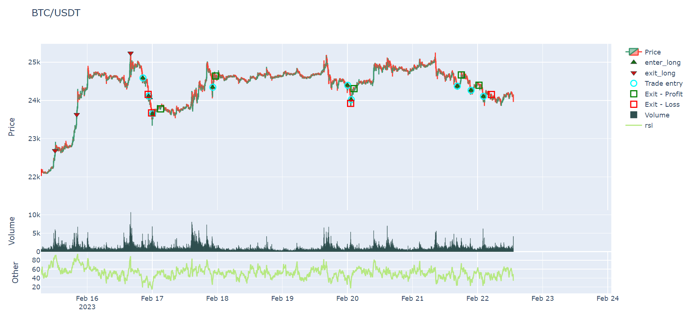
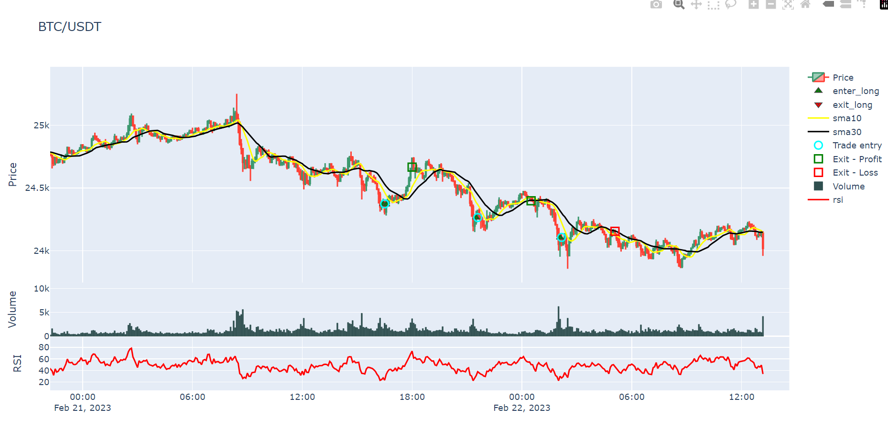
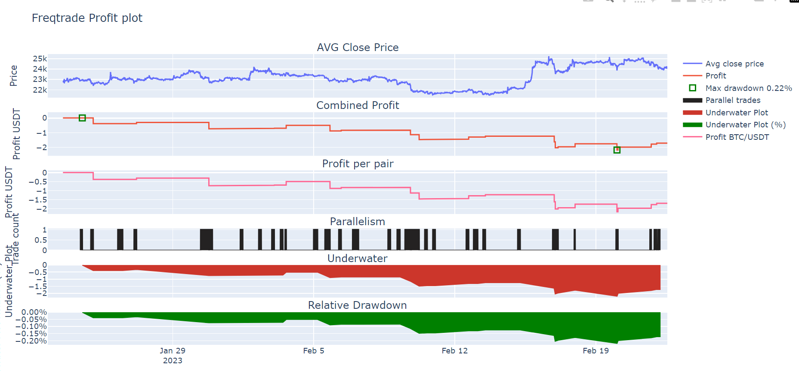

本文主要讲述如何使用Freqtrade绘制价格, 指标和利润图表

Freqtrade绘图使用plotly的Python版本, 官方网址: https://plotly.com/python/

## 安装

如果Python环境中缺少相应的绘图包, 也许需要使用以下命令安装

```python
pip install -U -r requirements-plot.txt
```

## 命令绘图

1. 绘图子命令: `freqtrade plot-dataframe`
2. 可选参数:
- --strategy: 策略名称 
- --pairs: 货币对
- --indicators1: 主图指标名称
- --indicators2: 附图指标名称
- --timerange: 时间区间
- --db-url: 数据库名称
- --export-filename: 回测结果文件名称
3. 使用示例
```python
freqtrade plot-dataframe --pairs BTC/USDT --strategy SampleStrategy --indicators2 rsi --timerange=20230101-
```
4. 注意事项: 只有在策略的"populate_indicators"方法中计算过的指标才可正确显示

执行命令后可以在"user_data/plot"文件夹下看到绘图的html文件



## 策略绘图

在策略中重写"plot_config"方法, 也可实现相应的绘图功能

注意事项: 只有在策略的"populate_indicators"方法中计算过的指标才可正确显示

```python
@property
def plot_config(self):
    """ """
    # 创建绘图参数字典
    plot_config = {}
    # 绘制主图指标
    plot_config['main_plot'] = {
        # 绘制ema, 设置颜色
        'sma10': {'color': 'yellow'},
        'sma30': {'color': '#000000'},
    }
    # 绘制附图指标
    plot_config['subplots'] = {
        # 绘制RSI, 设置颜色
        "RSI": {
            'rsi': {'color': 'red'}
        }
    }
    return plot_config

def populate_indicators(self, dataframe: DataFrame, metadata: dict) -> DataFrame:
    """ """
    # 计算rsi指标之后返回数据
    dataframe['rsi'] = ta.RSI(dataframe)
    dataframe['sma10'] = ta.SMA(dataframe, 10)
    dataframe['sma30'] = ta.SMA(dataframe, 20)
    return dataframe
```

输入绘图命令:
```python
freqtrade plot-dataframe --pairs BTC/USDT --strategy SampleStrategy
```



## 绘制利润图

1. 命令: `plot-profit`
2. 参数:
- --export-filename: 回测结果文件名称
- --db-url: 数据库名称
3. 使用示例
```python
freqtrade plot-profit  --pairs BTC/USDT --export-filename user_data/backtest_results/backtest-result-2023-02-26_11-03-25.json
```



4. 绘图解释
- 图1是货币对的平均收盘价
- 图2是回测获得的总利润
- 图3是每个货币对的利润
- 图4是交易时间点
- 图5是回撤时间周期(绝对值)
- 图6是回撤时间周期(百分比)
