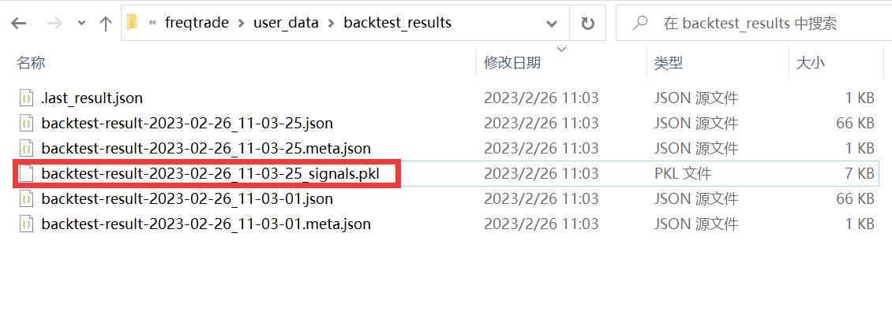
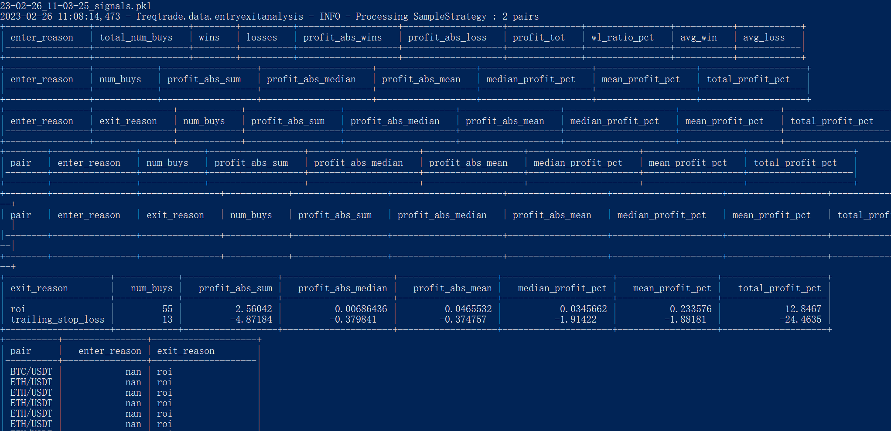
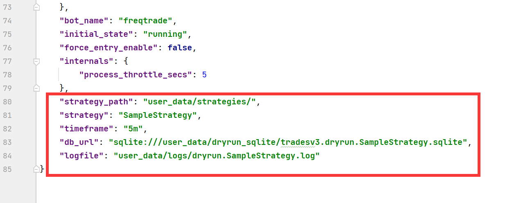
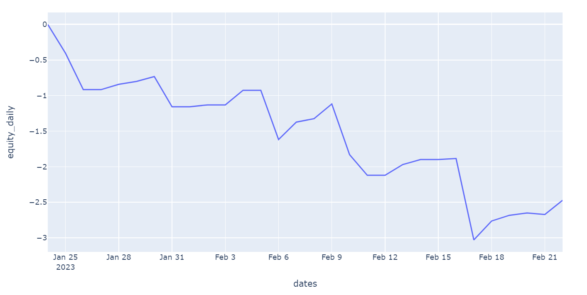
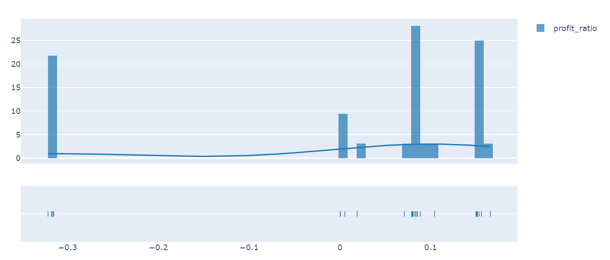

Freqtrade绘图使用plotly, 官方网址: https://plotly.com/python/

本文代码使用jupyter演示, jupyter配置参考: https://dumengru.com/docs_codenotes/01python%E7%8E%AF%E5%A2%83/07%E9%85%8D%E7%BD%AEjupyter/

## 回测分析

1. 导出交易信号

```python
freqtrade backtesting -c config.json --timeframe 5m --strategy SampleStrategy  --export=signals
```

backtest_results文件夹下出现"_signals.pkl"文件



2. 分析交易信号

```python
freqtrade backtesting-analysis -c <config.json> --analysis-groups 0 1 2 3 4 5
```

- 1按enter_tag分组的利润汇总
- 2按enter_tag和exit_tag分组的利润汇总
- 3按货币对和enter_tag分组的利润汇总
- 4按利润汇总成对分组
- 5按exit_tag分组的利润汇总



## 策略分析

#### 设置工作路径

1. 直接自定义工作路径

```python
import os

os.chdir("C:/Users/admin/Desktop/py_file/freqtrade")
print(os.getcwd())
```

2. 脚本搜索路径

```python
import os
from pathlib import Path

project_root = "somedir/freqtrade"
i=0
try:
    os.chdirdir(project_root)
    assert Path('LICENSE').is_file()
except:
    while i<4 and (not Path('LICENSE').is_file()):
        os.chdir(Path(Path.cwd(), '../'))
        i+=1
    project_root = Path.cwd()
print(Path.cwd())
```

#### 加载配置

1. 直接加载已有配置文件或者加载空配置之后自己添加配置

```python
from freqtrade.configuration import Configuration

# 根据文件初始化空的配置对象
# 方式一: 直接加载配置文件
config = Configuration.from_files(["user_data/config.json"])

# 方式二: 自己填写配置
# config = Configuration.from_files([])
# config["timeframe"] = '5m'
# config["datadir"] = Path("user_data/data/binance")
# config["datadir"], config["timeframe"]
config['strategy']
```

注意: 直接加载的配置文件要包括以下参数配置(之前写了在策略中或者命令行中)



#### 加载数据

```python
# Load data using values set above
from freqtrade.data.history import load_pair_history
from freqtrade.enums import CandleType

# 现货写法
# pair, candle_type = "BTC/USDT", CandleType.SPOT
# 期货写法
pair, candle_type = "BTC/USDT:USDT", CandleType.FUTURES

candles = load_pair_history(datadir=config["datadir"],
                            timeframe="5m",
                            pair=pair,
                            data_format="json",  # Make sure to update this to your data
                            candle_type=candle_type,
                            )

print(f'Loaded {len(candles)} rows of data for {pair} from {config["datadir"]}')
candles.head()
```

#### 查看信号

```python
# 查看信号
from freqtrade.resolvers import StrategyResolver
from freqtrade.data.dataprovider import DataProvider

strategy = StrategyResolver.load_strategy(config)
strategy.dp = DataProvider(config, None, None)

df = strategy.analyze_ticker(candles, {'pair': pair})
# 查看最后10个入场做多的信号
df_long = df[~pd.isna(df["enter_long"])]
df_long.tail(10)
```

查看做多信号总数

```python
# 查看做多信号总量
print(f"Generated {df['enter_long'].sum()} entry signals")
data = df.set_index('date', drop=False)
data.tail()
```

#### 回测结果分析

```python
from freqtrade.data.btanalysis import load_backtest_data, load_backtest_stats

# 方式一: 只写文件目录, 默认加载最新回测文件
backtest_dir = config["user_data_dir"] / "backtest_results"
# 方式二: 指定具体回测文件
# backtest_dir = config["user_data_dir"] / "backtest_results/backtest-result-2020-07-01_20-04-22.json"

stats = load_backtest_stats(backtest_dir)

strategy = 'SampleStrategy'

# 获取结果
for result in stats['strategy'][strategy]['results_per_pair']:
    print(result)

# 获取交易货币对
print(stats['strategy'][strategy]['pairlist'])

# 获取最大回撤
print(stats['strategy'][strategy]['max_drawdown'])
# 回撤开始和结束时间
print(stats['strategy'][strategy]['drawdown_start'])
print(stats['strategy'][strategy]['drawdown_end'])

# 多个策略结果对比
print(stats['strategy_comparison'])
```

#### 绘制每日收益

```python
# 绘制每日收益

from freqtrade.configuration import Configuration
from freqtrade.data.btanalysis import load_backtest_data, load_backtest_stats
import plotly.express as px
import pandas as pd


stats = load_backtest_stats(backtest_dir)
strategy_stats = stats['strategy'][strategy]

dates = []
profits = []
for date_profit in strategy_stats['daily_profit']:
    dates.append(date_profit[0])
    profits.append(date_profit[1])

equity = 0
equity_daily = []
for daily_profit in profits:
    equity_daily.append(equity)
    equity += float(daily_profit)


df = pd.DataFrame({'dates': dates,'equity_daily': equity_daily})

fig = px.line(df, x="dates", y="equity_daily")
fig.show()
```



## 实时分析

当我们需要分析实时交易的数据时, 需要从数据库加载交易数据

#### 数据统计

```python
from freqtrade.data.btanalysis import load_trades_from_db

# 从数据库加载交易对象(数据库路径相对于freqtrade)
trades = load_trades_from_db("sqlite:///tradesv3.dryrun.HourBased.sqlite")
# 离场数据信息统计
print(trades.groupby("pair")["exit_reason"].value_counts())

from freqtrade.data.btanalysis import analyze_trade_parallelism

# 统计每根K线上的开仓数量并绘图
parallel_trades = analyze_trade_parallelism(trades, '5m')
print(parallel_trades.tail())
parallel_trades.plot()
```

#### 绘制K线图

```python
from freqtrade.plot.plotting import  generate_candlestick_graph

pair = "BCH/USDT:USDT"
trades_red = trades.loc[trades['pair'] == pair]

data_red = data['2022-08-01':'2022-10-10']
# 绘制交易K线图
graph = generate_candlestick_graph(pair=pair,
                                   data=data_red,
                                   trades=trades_red,
                                   indicators1=['sma20', 'ema50', 'ema55'],
                                   indicators2=['rsi', 'macd', 'macdsignal', 'macdhist']
                                  )
# 在notebook中打开图形
# graph.show()

# 将在浏览器中打开图形
# graph.show(renderer="browser")
```

#### 绘制每笔交易的平均利润分布图

```python
import plotly.figure_factory as ff

hist_data = [trades.profit_ratio]
group_labels = ['profit_ratio']  # name of the dataset

fig = ff.create_distplot(hist_data, group_labels, bin_size=0.01)
fig.show()
```


