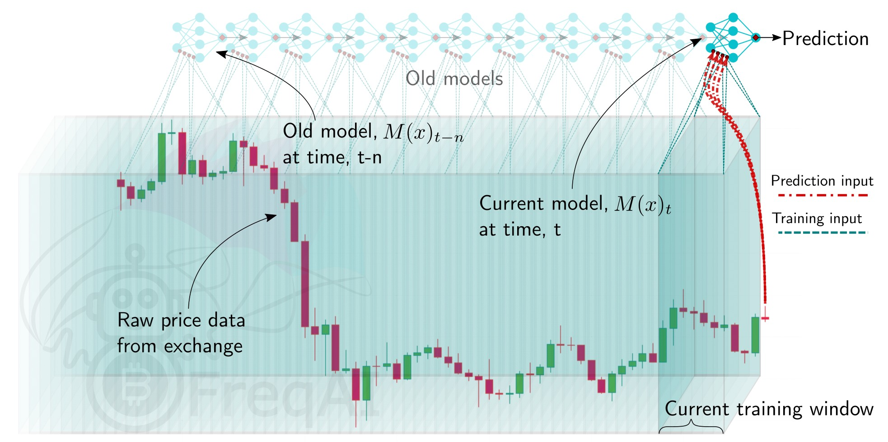
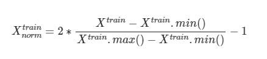
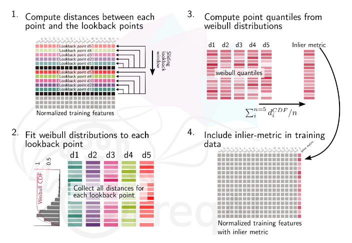
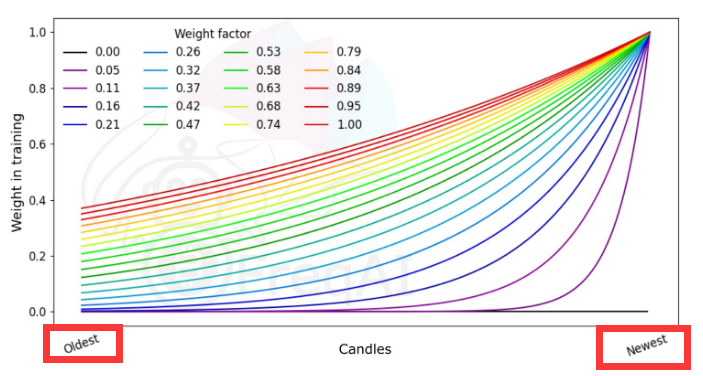
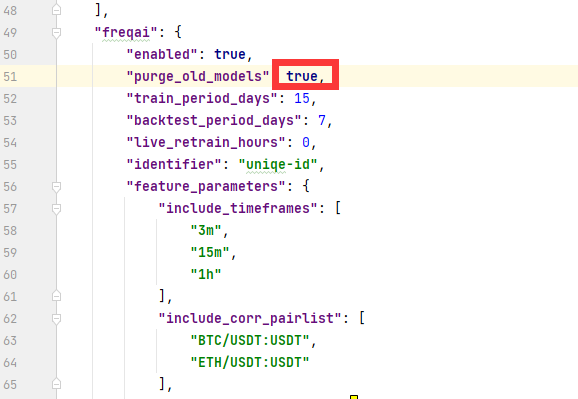
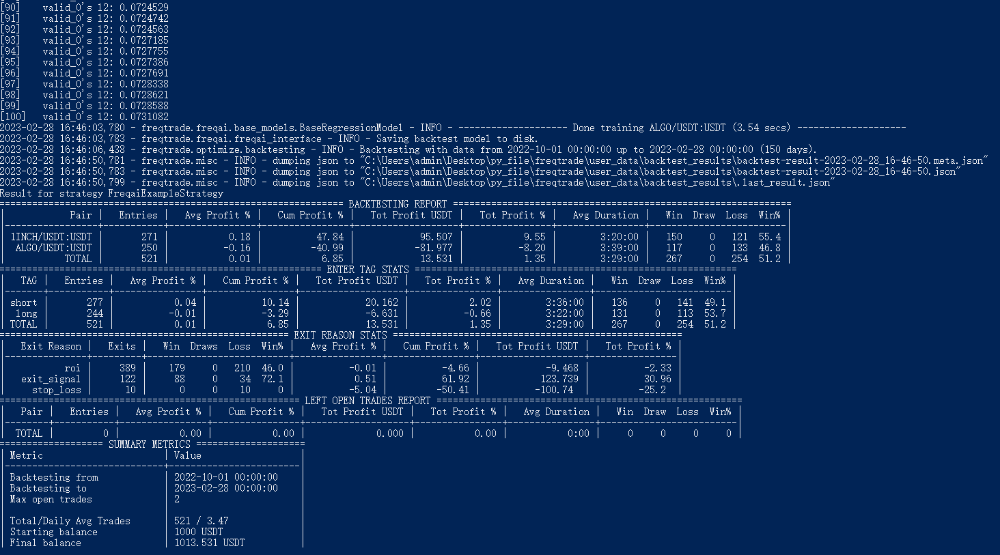

AI相关参考文档:

- scikit-learn文档: https://scikit-learn.org/stable/user_guide.html
- Keras文档: https://keras.io/zh/
- PyTorch文档: https://www.pytorchtutorial.com/docs/

- 动手学深度学习: http://zh.d2l.ai/
- 动手学强化学习: https://hrl.boyuai.com/chapter/intro

- stable-baselines3: https://stable-baselines3.readthedocs.io/en/master/index.html
- OpenAI gym: https://www.gymlibrary.dev/content/basic_usage/

## 参数表

#### 配置参数

- freqai: 所有freqai相关配置都在该字典内
- train_period_days: 训练数据的天数(滑动窗口宽度), 正整数
- backtest_period_days: 回测期间多久重新训练一次模型, 浮点数
- identifier: 模型id
- live_retrain_hours: 仿真/实盘重新运行频率
- expiration_hours: 如果模型超过expiration_hours则为旧模型, 请避免做出预测
- purge_old_models: 是否在本地保留旧模型, 默认为true
- save_backtest_models: 是否保存回测时生成的模型
- fit_live_predictions_candles: 指定长度的预测数据(而非真实历史数据)作为训练集预测标签
- continual_learning: 使用最近训练模型的最终状态作为新模型的起点
- write_metrics_to_disk: 在json文件中保存训练时间, 预测时间和cpu使用情况等数据
- data_kitchen_thread_count: 指定用于数据处理的线程数

#### 特征参数

- feature_parameters: 所有特征相关配置都在该字典内
- include_timeframes: 将指定时间周期的所有特征都计算一次
- include_corr_pairlist: 将指定货币对相关的所有特征都计算一次
- include_shifted_candles: 将指定平移周期的所有特征都计算一次
- indicator_periods_candles: 将指定指标周期的所有指标特征都计算一次
- label_period_candles: 预测未来的K线数, 正整数
- weight_factor: 时间重要性权重值
- principal_component_analysis: 使用主成分分析压缩数据
- plot_feature_importances: 为模型特征绘制重要性图, 保存在"models/id/sub-train.html"文件
- DI_threshold: 差异指数, 用以离群值检测, 0-1之间
- use_SVM_to_remove_outliers: 训练支持向量机以检测和删除异常值
- svm_params: 支持向量机参数
- use_DBSCAN_to_remove_outliers: 使用DBSCAN算法聚类以检测和删除异常值
- inlier_metric_window: 检查当前K线数据与先前时间点数据的相似程度, 整数, 默认0
- noise_standard_deviation: 向训练特征中添加噪声防止数据过拟合
- outlier_protection_percentage: 防止离群值检测方法丢弃过多数据
- shuffle_after_split: 打乱训练集和测试集数据(建议别用)

#### 数据分割参数

- data_split_parameters: 所有数据分割相关配置都在该字典内
- test_size: 测试集数据比例
- shuffle: 训练期间打乱数据(建议别用)

#### 模型训练参数

- model_training_parameters: 所有模型训练相关配置都在该字典内
- n_estimators: 估计器数量
- learning_rate: 学习率
- n_jobs: 并行使用的cpu数量

#### 其他参数

- freqai.keras: 是否使用Keras构建模型
- freqai.conv_width: 卷积神经网络输入张量宽度
- freqai.reduce_df_footprint: 将所有数字列重新转换为float32/int32

## 特征工程

#### 归一化

FreqAI使用最小最大值归一化(Min-Max Normalization)方法



#### 数据降维

FreqAI使用主成分分析降低特征维度, 需要启用配置

```json
"freqai": {
    "feature_parameters" : {
        "principal_component_analysis": true
    }
}
```

#### 内点度量

inlier_metric用来衡量当前数据点与最近的历史数据点的相似程度, 如果添加了"inlier_metric_window"参数, FreqAI计算"inlier_metric"特征逻辑如下



#### 时间重要性加权

设置了weight_factor参数之后, 最近的数据将会比过去的数据有更重要的权重, 大体示意图如下



#### 异常值检测

1. DI

FreqAI可以使用差异指数衡量模型预测的不确定性, 通过如下配置可从训练集/测试集中删除离群数据点

```json
"freqai": {
    "feature_parameters" : {
        "DI_threshold": 1
    }
}
```

2. SVM

也可以使用支持向量机识别异常值

```json
"freqai": {
    "feature_parameters" : {
        "use_SVM_to_remove_outliers": true
    }
}
```

3. DBSCAN 

也可以使用DBSCAN聚类识别异常值

```json
    "freqai": {
        "feature_parameters" : {
            "use_DBSCAN_to_remove_outliers": true
        }
    }
```

## 运行FreqAI

默认"config_examples/config_freqai.example.json"配置文件有一处错误, 修改为: "purge_old_models": true



#### 下载数据

```python
freqtrade download-data --exchange binance --pairs ETH/USDT:USDT BTC/USDT:USDT 1INCH/USDT:USDT ALGO/USDT:USDT -c config_examples/config_freqai.example.json -t 3m 5m 15m 1h 1d --timerange 20220101-
```
#### 回测

需要手动下载回测需要的数据, 务必确保有足够的历史数据做回测(回测起始时间要大于保存数据的起始时间N天, 以保证首次训练有数据)

回测命令

```python
freqtrade backtesting --strategy FreqaiExampleStrategy --strategy-path freqtrade/templates --config config_examples/config_freqai.example.json --freqaimodel LightGBMRegressor --timerange 20220501-20230101
```



#### 参数优化

1. 需要提前下载历史数据
2. 不能使用"--analyze-per-epoch"参数
3. 不能在"feature_engineering_*和set_freqai_targets"方法中使用优化参数

```python
freqtrade hyperopt --hyperopt-loss SharpeHyperOptLoss --strategy FreqaiExampleStrategy --freqaimodel LightGBMRegressor --strategy-path freqtrade/templates --config config_examples/config_freqai.example.json --timerange 20220501-20230101
```

示例: 通过参数优化寻找差异指数阈值
```python
di_max = IntParameter(low=1, high=20, default=10, space='buy', optimize=True, load=True)

dataframe['outlier'] = np.where(dataframe['DI_values'] > self.di_max.value/10, 1, 0)
```

#### 实时运行

自动下载所需数据

```python
freqtrade trade --strategy FreqaiExampleStrategy --config config_freqai.example.json --freqaimodel LightGBMRegressor
```

如果要从保存的回测模型开始运行, 需要添加配置

```json
"freqai": {
    "identifier": "example",
    "live_retrain_hours": 0.5
}
```
