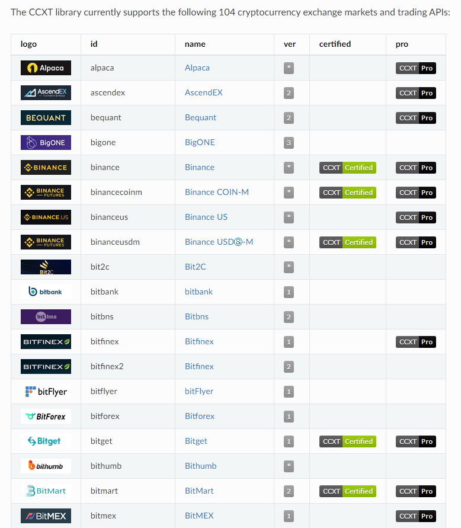

CCXT就是统一各大加密货币交易所接口的免费开源框架



CCXT官方文档: https://docs.ccxt.com/en/latest/index.html

CCXT中文手册: http://cw.hubwiz.com/card/c/ccxt-dev-manual/


## 简介

1. 安装

```python
pip install ccxt
```

2. CCXT有两个版本, 标准版(CCXT)和高级版(CCXT Pro), 原来CCXT Pro是收费的, 现在可以免费使用了

3. 截至2023年3月, CCXT支持104个加密货币交易所, CCXT Pro支持46个交易所, 具体可查看如下链接

CCXT支持: https://docs.ccxt.com/en/latest/exchange-markets.html

CCXT Pro支持: https://docs.ccxt.com/en/latest/ccxt.pro.manual.html#exchanges

## 使用

可以有三种方式调用CCXT

1. 标准用法

```python
import ccxt

print(ccxt.exchanges)
```

2. 支持异步

```python
import ccxt.async_support as ccxt

print(ccxt.exchanges)
```

3. 支持WebSocket

```python
import ccxt.pro as ccxt

print(ccxt.exchanges)
```

如果对异步编程有所了解的华, 建议使用第三种, 即CCXT Pro接口

## 交易所

#### 创建交易所

1. 方式一

```python
import ccxt.pro as ccxt

exchange = ccxt.binance()
print(exchange)
```

2. 方式二

```python
import ccxt.pro as ccxt

coinbasepro = getattr(ccxt, 'binance')()
print(exchange)
```

#### 传入参数

所有交易所相关参数通过字典方式直接传入即可, 交易所相关的apiKey, secret和password之类, 需要到对应交易所网站申请

```python
import ccxt.pro as ccxt

exchange_id = 'binance'
exchange_class = getattr(ccxt, exchange_id)
exchange = exchange_class({
    'apiKey': 'YOUR_API_KEY',
    'secret': 'YOUR_SECRET',
})
```

#### 测试网络

许多交易所会提供测试环境, 叫法不同: "testnets", "sandboxes" 或 "staging environments"

测试网络和量化交易种常提到的仿真交易环境有区别, 测试网络的市场价格数据和真实环境不一样, 而仿真交易则要求至少要用真实市场环境的成交价格

使用测试网络也需要申请对应的apiKey, secret和password之类, 然后在CCXT中设置"set_sandbox_mode(true)"即可

```python
import ccxt.pro as ccxt

exchange = ccxt.binance(
    {
    'apiKey': 'YOUR_API_KEY',
    'secret': 'YOUR_SECRET',
    }
)
exchange.set_sandbox_mode(True)
```

## 交易所模型

**交易所数据结构**

```json
{
    'id':   'exchange'                  // lowercase string exchange id
    'name': 'Exchange'                  // human-readable string
    'countries': [ 'US', 'CN', 'EU' ],  // array of ISO country codes
    'urls': {
        'api': 'https://api.example.com/data',  // string or dictionary of base API URLs
        'www': 'https://www.example.com'        // string website URL
        'doc': 'https://docs.example.com/api',  // string URL or array of URLs
    },
    'version':         'v1',            // string ending with digits
    'api':             { ... },         // dictionary of api endpoints
    'has': {                            // exchange capabilities
        'CORS': false,
        'publicAPI': true,
        'privateAPI': true,
        'cancelOrder': true,
        'createDepositAddress': false,
        'createOrder': true,
        'deposit': false,
        'fetchBalance': true,
        'fetchClosedOrders': false,
        'fetchCurrencies': false,
        'fetchDepositAddress': false,
        'fetchMarkets': true,
        'fetchMyTrades': false,
        'fetchOHLCV': false,
        'fetchOpenOrders': false,
        'fetchOrder': false,
        'fetchOrderBook': true,
        'fetchOrders': false,
        'fetchStatus': 'emulated',
        'fetchTicker': true,
        'fetchTickers': false,
        'fetchBidsAsks': false,
        'fetchTrades': true,
        'withdraw': false,
    },
    'timeframes': {                     // empty if the exchange !has.fetchOHLCV
        '1m': '1minute',
        '1h': '1hour',
        '1d': '1day',
        '1M': '1month',
        '1y': '1year',
    },
    'timeout':          10000,          // number in milliseconds
    'rateLimit':        2000,           // number in milliseconds
    'userAgent':       'ccxt/1.1.1 ...' // string, HTTP User-Agent header
    'verbose':          false,          // boolean, output error details
    'markets':         { ... }          // dictionary of markets/pairs by symbol
    'symbols':         [ ... ]          // sorted list of string symbols (traded pairs)
    'currencies':      { ... }          // dictionary of currencies by currency code
    'markets_by_id':   { ... },         // dictionary of dictionaries (markets) by id
    'proxy': 'https://crossorigin.me/', // string URL
    'apiKey':   '92560ffae9b8a0421...', // string public apiKey (ASCII, hex, Base64, ...)
    'secret':   '9aHjPmW+EtRRKN/Oi...'  // string private secret key
    'password': '6kszf4aci8r',          // string password
    'uid':      '123456',               // string user id
}
```

- id: 每个交易所都有一个默认id，它是一个字符串常量，用于在ccxt中唯一的标识一个特定的交易所实例。 你可以有多个接入同一个交易所的ccxt交易所实例，可以使用id进行区分。默认的交易所id是全小写字符， 对应交易所的名称

- name：方便人类查看的交易所名称，字符串常量

- countries: 国别代码字符串数组，每个成员都是2个字符长的ISO国别代码，表示交易所的运营所在地

- urls['api']: 用于ccxt调用的交易所API url字符串，或者是包含了公开和私有API url的关联数组

- urls['www']: 交易所的官网URL

- urls['doc']: 交易所API文档的官方URL，可以是单个url或url数组

- version: 当前使用的交易所API的版本号，CCXT在调用交易所API时将在每个请求的URL中添加这个版本号。 除非你要实现一个新的交易所API，否则你不需要修改这个字段

- api: 一个包含了交易所的所有API访问端结点的关联数组。ccxt使用这个API定义为每个可用访问端结点 自动构造交易所实例方法

- has: 描述交易所特性支持能力的关联数组，例如 fetchTickers、fetchOHLCV 或CORS

- timeframes: 交易所的fetchOHLCV方法支持的时间尺度，关联数组，键为时间尺度缩写。只有当 ['fetchOHLCV']属性为真时，ccxt才会填充这个字段的内容

- timeout: ccxt访问交易所API时，请求-响应的超时设置，单位：毫秒，默认值：10000，即10秒。你 应当根据自己的网络情况进行适当的设置

- rateLimit: 交易所API的请求限流，单位：毫秒，表示向同一交易所发出的两次请求之间需要的最小延迟间隔。 默认情况下ccxt禁用内置的限流功能，可以通过设置enableRateLimit来启用API访问限流

- enableRateLimit: 是否启用内置的限流机制，布尔值，默认值：false。调用者需要开启内置的限流机制 或者自己实现限流，以避免被交易所禁止访问

- userAgent: 用于设置HTTP请求头中的User-Agent。ccxt默认会设置自己的User-Aget，有些交易所可能 不允许ccxt访问，你可以将这个值设置为false、undefined或空字符串

- verbose: 是否记录HTTP请求信息到标准输出设备，布尔值，默认：false。Python开发者可以使用提单的 日志调试方法，方法时在代码开头添加以下代码：

```python
import logging
logging.basicConfig(level=logging.DEBUG)
```
- markets: 市场描述关联数组，键为交易对或交易符号。在访问这个属性之前需要先调用loadMarkets()或 load_markets()载入市场数据

- symbols: 交易所的有效符号的数组，以字母表顺序排列。这些符号是市场对象的键，可以用来方便地 访问指定的市场

- currencies: 交易所的有效数字货币的关联数组，键为数字货币的代码（3~4字母）。数字货币从市场 载入

- markets_by_id: 按交易所列举的市场关联数值。在访问此属性之前需要先载入市场

- proxy: 用来访问交易所的http(s)代理的URL字符串，例如'http://crossorigin.me/'，默认值：''

- apiKey: 用来访问交易所的API Key。大部分交易所需要API Key才能访问其API

- secret: 用来访问交易所的密文。大部分交易所需要同时提供api key和密文

- password: 交易所要求的交易密码。有些交易所在交易时要求提供这个密码，但是大多数交易所不需要

- uid: 你的交易所账户的唯一ID。可以是字符串或数。有些交易所在交易时也需要提供这个信息，但是大多数交易所不需要

- requiredCredentials: 统一的身份信息关联数组，定义需要哪些身份信息才能访问交易所的私有API

- options: 一个针对特定交易所的关联数组，定义该交易所支持的特定的选项

- precisionMode: 交易所的小数精度模式

- has: 描述交易所支持特性的关联数组，特性的值为true、'false'或emulated，其含义如下：
    1. true表示该特性是交易所API原生支持的，并且在cctx库中通过统一API提供访问接口
    2. false表示该特性不是交易所API原生支持的，并且在cctx库中没有访问该特性的统一API
    3. emulated表示该特性不是交易所API原生支持的，但是cctx库通过统一API提供了该特性
    
#### 交易所属性

1. 限流: 要么自己设置 exchange.rateLimit属性, 要么设置 .enableRateLimit=True(默认True), 启用内置限流器

2. 有的交易所使用Cloudflare或Incapsula的DDoS保护, 有时会限制访问

## 示例

一些共有API操作, 不需要apiKey, 一些私有API操作则必须有apiKey

```python
import ccxt


exchange = ccxt.binance(
    {
    'apiKey': 'YOUR_API_KEY',
    'secret': 'YOUR_SECRET',
    }
)

print("全部接口: ", exchange.has)
print("交易所状态: ", exchange.fetch_status())

# 没有正确的apiKey会报错
# print("获取账户余额: ", exchange.fetch_balance())
```
