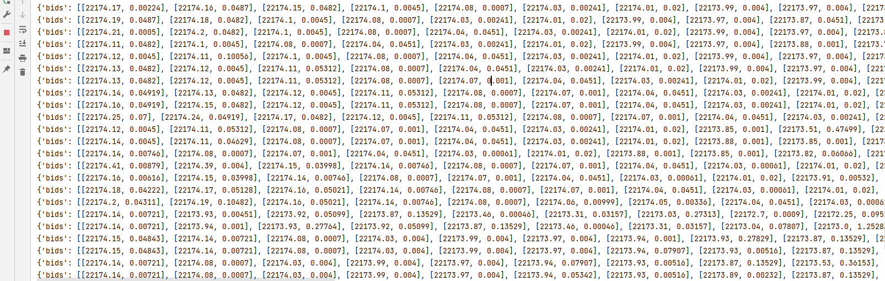

实际上知道了如何获取行情和如何下单, 就已经掌握了CCXT的核心. 至于`ccxt.async_support`和`ccxt.pro`, 根据自己的需求学习, 毕竟异步编程终究是麻烦点

## CCXT Pro

#### 介绍

CCXT Pro是CCXT的高级版本, 功能更加强大. 使用CCXT Pro必须一下两点:
1. 账户CCXT基础版本的基本用法
2. 熟悉Python异步编程(Async)

从基础版到高级版, 其中一个重要的变化是由基于请求-响应的API改为基于连接的流式API(WebSocket), 对应的方法修改如下:


#### 示例

```python
import asyncio
import ccxt.pro as ccxt
from ccxt_passward import BinanceKey

exchange = ccxt.binance(
    {
    'apiKey': BinanceKey.apikey.value,
    'secret': BinanceKey.secret.value,
    }
)

symbol = "BTC/USDT"
limit = 10

async def print_data():
    while True:
        try:
            orderbook = await exchange.watch_order_book(symbol, limit)
            print(orderbook)
        except Exception as e:
            pass

if __name__ == '__main__':
    asyncio.run(print_data())
```




## 总结

实际上CCXT并不大适合用来直接编写量化交易策略, 除非我们已经有了完整的量化交易系统. 

实现任何一个交易策略的逻辑都是简单的, 复杂的是编写完策略后的修改, 调试, 监控以及同时维护多个策略...等

**幸运的是我们已经有了Freqtrade, 它足够优秀**
